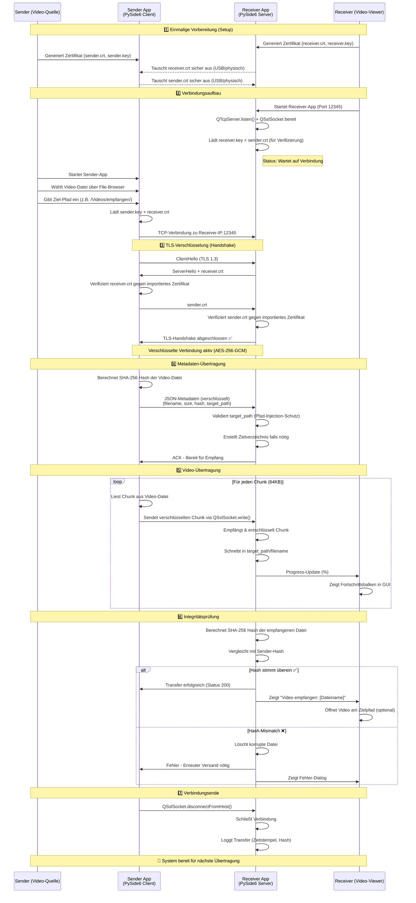

```mermaid
sequenceDiagram
    participant S as Sender (Video-Quelle)
    participant SA as Sender App<br/>(PySide6 Client)
    participant RA as Receiver App<br/>(PySide6 Server)
    participant R as Receiver (Video-Viewer)
    
    Note over S,R: 1️⃣ Einmalige Vorbereitung (Setup)
    
    R->>RA: Generiert Zertifikat (receiver.crt, receiver.key)
    S->>SA: Generiert Zertifikat (sender.crt, sender.key)
    RA-->>SA: Tauscht receiver.crt sicher aus (USB/physisch)
    SA-->>RA: Tauscht sender.crt sicher aus (USB/physisch)
    
    Note over S,R: 2️⃣ Verbindungsaufbau
    
    R->>RA: Startet Receiver-App (Port 12345)
    RA->>RA: QTcpServer.listen() + QSslSocket bereit
    RA->>RA: Lädt receiver.key + sender.crt (für Verifizierung)
    Note right of RA: Status: Wartet auf Verbindung
    
    S->>SA: Startet Sender-App
    S->>SA: Wählt Video-Datei über File-Browser
    S->>SA: Gibt Ziel-Pfad ein (z.B. /Videos/empfangen/)
    SA->>SA: Lädt sender.key + receiver.crt
    SA->>RA: TCP-Verbindung zu Receiver-IP:12345
    
    Note over SA,RA: 3️⃣ TLS-Verschlüsselung (Handshake)
    
    SA->>RA: ClientHello (TLS 1.3)
    RA->>SA: ServerHello + receiver.crt
    SA->>SA: Verifiziert receiver.crt gegen importiertes Zertifikat
    SA->>RA: sender.crt
    RA->>RA: Verifiziert sender.crt gegen importiertes Zertifikat
    RA->>SA: TLS-Handshake abgeschlossen ✅
    Note over SA,RA: Verschlüsselte Verbindung aktiv (AES-256-GCM)
    
    Note over S,R: 4️⃣ Metadaten-Übertragung
    
    SA->>SA: Berechnet SHA-256 Hash der Video-Datei
    SA->>RA: JSON-Metadaten (verschlüsselt)<br/>{filename, size, hash, target_path}
    RA->>RA: Validiert target_path (Pfad-Injection-Schutz)
    RA->>RA: Erstellt Zielverzeichnis falls nötig
    RA->>SA: ACK - Bereit für Empfang
    
    Note over S,R: 5️⃣ Video-Übertragung
    
    loop Für jeden Chunk (64KB)
        SA->>SA: Liest Chunk aus Video-Datei
        SA->>RA: Sendet verschlüsselten Chunk via QSslSocket.write()
        RA->>RA: Empfängt & entschlüsselt Chunk
        RA->>RA: Schreibt in target_path/filename
        RA->>R: Progress-Update (%)
        R->>R: Zeigt Fortschrittsbalken in GUI
    end
    
    Note over S,R: 6️⃣ Integritätsprüfung
    
    RA->>RA: Berechnet SHA-256 Hash der empfangenen Datei
    RA->>RA: Vergleicht mit Sender-Hash
    
    alt Hash stimmt überein ✅
        RA->>SA: Transfer erfolgreich (Status 200)
        RA->>R: Zeigt "Video empfangen: [Dateiname]"
        R->>R: Öffnet Video am Zielpfad (optional)
    else Hash-Mismatch ❌
        RA->>RA: Löscht korrupte Datei
        RA->>SA: Fehler - Erneuter Versand nötig
        RA->>R: Zeigt Fehler-Dialog
    end
    
    Note over S,R: 7️⃣ Verbindungsende
    
    SA->>RA: QSslSocket.disconnectFromHost()
    RA->>RA: Schließt Verbindung
    RA->>RA: Loggt Transfer (Zeitstempel, Hash)
    
    Note over S,R: 🔁 System bereit für nächste Übertragung
```